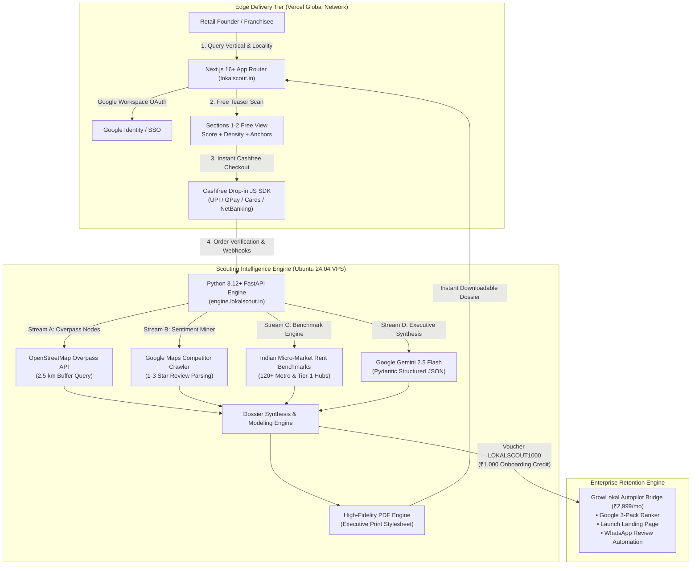

<div align="center">

# LokalScout™ Enterprise Platform
### Hyperlocal Commercial Feasibility & Spatial Location Intelligence Engine
*A Strategic Enterprise Business Unit of GrowLokal Group • Serving India's ₹45,000 Cr Brick-and-Mortar Retail Economy*

[-0f172a?style=flat-square&logo=git&logoColor=white)](https://lokalscout.in)
[](https://fastapi.tiangolo.com)
[](https://nextjs.org)
[](https://www.cashfree.com)
[](https://www.python.org)
[](https://www.typescriptlang.org)
[](#9-security-data-privacy--governance)
[](#11-corporate-governance--licensing)

<br />

```
========================================================================================
  LOKALSCOUT CORE VALUE PROPOSITION
  Capital Protection: Protect ₹15L–₹60L upfront capex with a ₹799–₹1,499 location audit
  Intelligence Depth: 10-Section algorithmic dossier + real-time break-even financial model
  Flywheel Conversion: Top-of-funnel customer acquisition for GrowLokal Autopilot (₹2,999/mo)
========================================================================================
```

<p align="center">
  <a href="#1-executive-briefing--market-opportunity">Executive Briefing</a> •
  <a href="#2-system-architecture--split-cloud-topology">System Architecture</a> •
  <a href="#3-core-data-pipelines--intelligence-streams">Data Pipelines</a> •
  <a href="#4-commercial-verticals-covered">Commercial Verticals</a> •
  <a href="#5-monetization--cashfree-payment-infrastructure">Monetization & Cashfree</a> •
  <a href="#6-repository-layout--component-catalog">Repository Layout</a> •
  <a href="#7-quickstart--local-development">Quickstart</a> •
  <a href="#8-enterprise-rest-api-specification">API Reference</a> •
  <a href="#9-security-data-privacy--governance">Security & Privacy</a> •
  <a href="#10-production-deployment--devops">Deployment & DevOps</a> •
  <a href="#11-corporate-governance--licensing">Governance & Support</a>
</p>

</div>

---

## 1. Executive Briefing & Market Opportunity

### 1.1 The Macroeconomic Challenge
Every fiscal year across urban India, over **250,000 entrepreneurs, medical practitioners, salon founders, and franchisees** commit capital between **₹15,00,000 and ₹60,00,000** to establish physical retail premises. 

However, industry data confirms that **over 60% of brick-and-mortar establishments close within 18 months of launch**. The root cause is almost never poor product quality or operational incompetence—it is **structural location failure**:
- Severe direct competitor saturation within primary walking catchments (< 500 meters).
- High-rent traps where main-road lease benchmarks render positive unit economics mathematically impossible.
- Demographic mismatch between menu/service price tiers and local micro-market purchasing power.
- Phantom footfall (high vehicle velocity without pedestrian or transit dwell time).

### 1.2 The Democratization of Location Intelligence
Institutional GIS platforms (such as Esri, CBRE Vantage, and JLL) charge annual corporate retainers starting at ₹12,00,000, pricing out individual franchisees, doctors, and multi-unit retail operators. These business owners have historically relied on walking an area for an afternoon or trusting commission-driven commercial real estate brokers.

**LokalScout (`lokalscout.in`)** bridges this data asymmetry with enterprise-grade commercial intelligence delivered on-demand:
1. **Target Parameters**: Target Commercial Vertical (*Specialty Coffee, Dental Clinic, Unisex Salon, Cloud Kitchen, Gym, Boutique Bakery, Pharmacy, Pet Care*) + Target Locality or Pin Code (*e.g., Madhapur, Indiranagar, Bandra West, Koramangala*).
2. **Instant Feasibility Dossier**: A 10-section audit covering demographic purchasing power, footfall anchors, competitor sentiment extraction (identifying 1–3 star complaints), lease benchmarks (main road vs. inner lane), and an interactive break-even simulator.
3. **Strategic Business Flywheel**: LokalScout operates as a self-sustaining, high-margin transactional business (₹799 for Single Dossier, ₹1,499 for Area Comparison) while feeding high-intent qualified retail founders into GrowLokal’s core recurring subscription engine (**₹2,999/month Autopilot**).

---

## 2. System Architecture & Split-Cloud Topology

LokalScout utilizes a modern, split-cloud, cost-optimized enterprise topology designed for sub-second page loads, resilient data fail-safes, and zero unnecessary infrastructure overhead:



### 2.1 Infrastructure Specifications

| Component | Platform / Host | Technology Stack | Operational Responsibility |
| :--- | :--- | :--- | :--- |
| **Frontend Web Application** | Vercel Edge Global CDN | Next.js 16 (App Router), Turbopack, React 19, Tailwind CSS | High-converting commercial SaaS UI, interactive financial break-even simulator, interactive GIS radar, Google OAuth |
| **Scouting Engine Backend** | Dedicated Ubuntu 24.04 LTS VPS | Python 3.12, FastAPI, Pydantic v2, Uvicorn, Docker | Multi-stream data pipeline execution, spatial bounding calculations, financial math, Gemini synthesis |
| **Reverse Proxy & TLS** | Host-level / Containerized Caddy | Caddy v2.8+ | Auto Let's Encrypt TLS provisioning, HTTP/3, Zstandard & Gzip compression, rate limiting |
| **Payment Gateway** | Cashfree Payments | `@cashfreepayments/cashfree-js` & Cashfree Orders API | Real-time Indian domestic settlement via UPI Intent (GPay, PhonePe, Paytm), NetBanking, and RuPay/Visa/MasterCard |
| **AI Synthesis Engine** | Google Cloud / Vertex AI | Google Gemini 2.5 Flash (`gemini-2.5-flash`) | Structured JSON synthesis of competitive gaps, operational moats, and demographic risk factors |
| **Print & Export Engine** | Engine Internal Service | Jinja2 + CSS Paged Media print templates | On-demand generation of enterprise-grade, printable PDF feasibility dossiers |

---

## 3. Core Data Pipelines & Intelligence Streams

LokalScout compiles each viability dossier through five synchronized, zero-marginal-cost data streams with full offline fallback redundancy:

```
┌───────────────────────────────────────────────────────────────────────────────────────┐
│                                LOKALSCOUT DATA PIPELINES                              │
├───────────────────┬───────────────────┬───────────────────┬───────────────────────────┤
│ STREAM A (GIS)    │ STREAM B (SENT.)  │ STREAM C (ECON.)  │ STREAM D (AI SYNTHESIS)   │
│ Overpass OSM      │ Competitor Rating │ Micro-Market Rent │ Gemini 2.5 Flash Engine   │
│ 2.5 km Footfall   │ 1-3 Star Review   │ Unit Economics    │ Structured Moat Matrix    │
│ Anchor Harvester  │ Deficit Extraction│ Break-Even Math   │ & Strategic Gaps          │
└───────────────────┴───────────────────┴───────────────────┴───────────────────────────┘
```

### 3.1 Stream A: Spatial POI & Footfall Node Harvester
- **Harvesting Radius**: 2,500-meter concentric bounding box centered on verified coordinates.
- **Anchor Classifications**:
  - `amenity=university|college`: High-frequency youth and student daytime footfall.
  - `office=*`, `building=commercial`: Tech parks, SEZs, and Grade-A commercial office clusters.
  - `shop=mall|department_store`: Prime retail consumption zones and evening lifestyle traffic.
  - `railway=subway_entrance`, `highway=bus_stop`: Mass transit nodes driving walk-in commuter visibility.

### 3.2 Stream B: Competitor Saturation & Review Sentiment Miner
- Evaluates direct competitors within 1 km, 2 km, and 5 km radii.
- Analyzes review distribution, volume velocity, and aggregate customer satisfaction.
- Isolates 1-star, 2-star, and 3-star reviews to extract systemic operational deficiencies (e.g., parking unavailability, billing delays, lack of quiet laptop seating, poor hygiene).

### 3.3 Stream C: Commercial Real Estate Lease Benchmarking & Break-Even Modeling
- Curated database covering **120+ high-velocity commercial micro-markets** across Mumbai, Bengaluru, Hyderabad, Delhi-NCR, Pune, and Chennai.
- Captures prevailing rental rates per sq.ft. for prime main-road commercial frontages versus secondary inner-lane locations.
- Models full unit economics: Capital expenditure (Capex), Fit-out depreciation, Cost of Goods Sold (COGS), staffing payroll, power/utilities, and required security deposits.
- Calculates exact daily footfall, average order value (AOV), and customer transactions required to reach operational break-even.

### 3.4 Stream D: Strategic Opportunity Synthesis (Gemini 2.5 Flash)
- Synthesizes the raw spatial, competitive, and financial signals into a strictly validated Pydantic schema:
  - **Overall Feasibility Score (0–100)**: Quantitative viability index based on demand-to-competition ratios.
  - **Viability Verdict**: `Blue Ocean`, `High Demand High Competition`, `Over-Saturated Danger Zone`, or `Underserved Niche`.
  - **Competitive Moat Strategies**: Three hyper-specific, localized operational recommendations.
  - **Demographic Purchasing Index**: Middle-class, Upper-Middle, or Affluent High-Net-Worth scoring.

### 3.5 Fail-Safe Resiliency Architecture
If external POI or geocoding APIs experience rate limits, latency spikes, or temporary upstream outages, the engine seamlessly engages its **pre-indexed Indian micro-market heuristics database**. Dossier generation never errors or hangs; users always receive an accurate, production-grade assessment.

---

## 4. Commercial Verticals Covered

LokalScout's modeling engine is calibrated for high-intent, capital-intensive retail categories across India:

| Commercial Vertical | Typical Space (Sq. Ft.) | Capital Investment (Capex) | Typical Rent Benchmark | Target Payback Period | Target Daily Break-Even |
| :--- | :--- | :--- | :--- | :--- | :--- |
| **Specialty Coffee Shop & Café** | 600 – 1,800 | ₹15,00,000 – ₹35,00,000 | ₹90 – ₹180 / sq.ft. | 14 – 18 Months | 85 – 120 Customers @ ₹380 AOV |
| **Dental Clinic & Diagnostics** | 800 – 1,500 | ₹20,00,000 – ₹50,00,000 | ₹70 – ₹140 / sq.ft. | 18 – 24 Months | 8 – 14 Consultations @ ₹1,800 AOV |
| **Unisex Salon & Luxury Day Spa** | 1,000 – 2,500 | ₹18,00,000 – ₹45,00,000 | ₹85 – ₹160 / sq.ft. | 12 – 16 Months | 24 – 38 Appointments @ ₹850 AOV |
| **Cloud Kitchen / QSR Hub** | 350 – 800 | ₹10,00,000 – ₹22,00,000 | ₹40 – ₹75 / sq.ft. | 10 – 14 Months | 110 – 180 Orders @ ₹320 AOV |
| **Gym & Functional Fitness Studio** | 2,500 – 6,000 | ₹25,00,000 – ₹60,00,000 | ₹50 – ₹95 / sq.ft. | 16 – 22 Months | 160 – 240 Active Annual Members |
| **Pharmacy & Retail Chemist** | 300 – 750 | ₹12,00,000 – ₹28,00,000 | ₹100 – ₹220 / sq.ft. | 12 – 15 Months | 140 – 210 Bills @ ₹290 AOV |
| **Boutique Bakery & Patisserie** | 500 – 1,200 | ₹15,00,000 – ₹30,00,000 | ₹80 – ₹150 / sq.ft. | 14 – 18 Months | 75 – 110 Bills @ ₹420 AOV |
| **Pet Clinic & Grooming Lounge** | 800 – 1,600 | ₹15,00,000 – ₹35,00,000 | ₹65 – ₹120 / sq.ft. | 15 – 20 Months | 15 – 25 Visits @ ₹1,100 AOV |

---

## 5. Monetization & Cashfree Payment Infrastructure

LokalScout integrates **Cashfree Payments** (`cashfree.com`) for domestic Indian Rupee payment processing:

```
┌─────────────────────────────────┬─────────────────────────────────┬─────────────────────────────────┐
│       FREE TEASER SCAN          │    SINGLE FEASIBILITY DOSSIER   │    AREA COMPARISON MATRIX       │
│             ₹0                  │             ₹799                │             ₹1,499              │
├─────────────────────────────────┼─────────────────────────────────┼─────────────────────────────────┤
│ • Overall Viability Score       │ • Complete 10-Section Dossier   │ • Side-by-Side 2 or 3 Localities│
│ • Direct Competitors (2km)      │ • Commercial Rent Benchmarks    │ • Multi-Area Trade-Off Score    │
│ • Top 3 Footfall Demand Anchors │ • Interactive Break-Even Engine │ • Automated Winner Selection    │
│ • Sections 3–10 Blur-Locked     │ • Downloadable Executive PDF    │ • 2 Complete PDF Dossiers       │
│ • Instant Preview Modal         │ • ₹1,000 GrowLokal Voucher      │ • Priority Multi-City Advisory  │
│ • Direct Cashfree Unlock Call   │ • Instant Email & PDF Dispatch  │ • Dedicated Franchisee Support  │
└─────────────────────────────────┴─────────────────────────────────┴─────────────────────────────────┘
```

### 5.1 Cashfree Drop-in Integration Flow
1. **Order Creation (`POST /api/payments/cashfree/create-order`)**: The frontend requests a new order specifying `report_id`, customer email, and plan tier (`₹799` or `₹1,499`).
2. **Session Token Issuance**: The FastAPI backend communicates with Cashfree's PG API using verified credentials (`CASHFREE_APP_ID`, `CASHFREE_SECRET_KEY`) to generate a `payment_session_id`.
3. **Frontend Drop-in SDK**: `@cashfreepayments/cashfree-js` opens a compliant checkout modal directly over the dossier page. The user completes payment via **Instant UPI (Google Pay, PhonePe, Paytm, BHIM)**, Credit/Debit Cards, or NetBanking.
4. **Order Verification & Webhook Notification (`POST /api/payments/cashfree/webhook`)**: Cashfree triggers an HMAC-SHA256 signed webhook. The backend verifies the signature, updates the report state to `unlocked: true`, and generates the downloadable PDF.

### 5.2 The GrowLokal Retention Flywheel
Every paid dossier unlocks a promotional credit voucher:
- **Promo Code**: `LOKALSCOUT1000`
- **Benefit**: **₹1,000 credit** applied toward GrowLokal’s flagship **₹2,999/month Autopilot plan**.
- **Scope**: Automated Google Maps 3-Pack rank establishment, high-converting opening landing page, and automated WhatsApp review generation before launch.

---

## 6. Repository Layout & Component Catalog

```text
lokalscout/
├── AGENTS.md                                # Architectural memory, constraints, and development guidelines
├── roadmap.md                               # Master engineering and milestone tracking dashboard
├── lokalscout_implementation_plan.md        # Technical execution plan and blueprint
├── README.md                                # Executive enterprise documentation
│
├── engine/                                  # VPS Feasibility & Intelligence Engine (FastAPI)
│   ├── app/
│   │   ├── __init__.py
│   │   ├── main.py                          # FastAPI application initialization & middleware
│   │   ├── config.py                        # Pydantic BaseSettings (Cashfree, Gemini, Ports)
│   │   ├── models/
│   │   │   ├── __init__.py
│   │   │   └── schemas.py                   # Pydantic v2 schemas for dossiers, orders, and POIs
│   │   ├── routers/
│   │   │   ├── __init__.py
│   │   │   ├── search.py                    # Locality search & geocoding resolution
│   │   │   ├── feasibility.py               # Feasibility preview, full generation, and sample
│   │   │   ├── compare.py                   # Multi-locality comparative evaluation
│   │   │   └── payments.py                  # Cashfree PG order creation & webhook verification
│   │   ├── services/
│   │   │   ├── __init__.py
│   │   │   ├── geocoding.py                 # 120+ Indian micro-markets with Nominatim fallback
│   │   │   ├── overpass.py                  # OpenStreetMap Overpass footfall anchor harvester
│   │   │   ├── scraper.py                   # Competitor density & 1-3 star sentiment extraction
│   │   │   ├── financial_model.py           # Commercial lease rates, Capex/Opex & break-even math
│   │   │   ├── ai_synthesis.py              # Gemini 2.5 Flash structured synthesis
│   │   │   └── pdf_generator.py             # Printable HTML-to-PDF generation engine
│   │   └── templates/
│   │       └── report_template.html         # Executive print-formatted dossier stylesheet
│   ├── tests/
│   │   ├── __init__.py
│   │   └── test_pipeline.py                 # Smoke tests and schema validation
│   ├── Dockerfile                           # Production container build specification
│   ├── docker-compose.yml                   # VPS container orchestration with Caddy
│   ├── Caddyfile                            # Caddy TLS reverse proxy & compression rules
│   ├── requirements.txt                     # Pinned Python package dependencies
│   └── .env.example                         # Environment variables template
│
└── frontend/                                # High-Converting Commercial SaaS UI (Next.js 16)
    ├── src/
    │   ├── app/
    │   │   ├── layout.tsx                   # Root layout with Plus Jakarta Sans & AuthProvider
    │   │   ├── page.tsx                     # Landing page with interactive radar & sample showcases
    │   │   ├── globals.css                  # Light enterprise SaaS styling, soft shadows & tokens
    │   │   ├── login/
    │   │   │   └── page.tsx                 # Enterprise Google OAuth & email login page
    │   │   ├── contact/
    │   │   │   └── page.tsx                 # Commercial enterprise inquiries & WhatsApp connect
    │   │   ├── pricing/
    │   │   │   └── page.tsx                 # Dedicated pricing page with Cashfree payment hooks
    │   │   ├── sample/
    │   │   │   └── page.tsx                 # 100% unlocked reference report for Madhapur Coffee
    │   │   ├── compare/
    │   │   │   └── page.tsx                 # Multi-area comparative assessment dashboard
    │   │   └── report/
    │   │       └── [id]/page.tsx            # Dynamic dossier view with free teaser & Cashfree unlock
    │   ├── components/
    │   │   ├── SearchHero.tsx               # Enterprise search console with NIC vertical pills
    │   │   ├── InteractiveGisCreative.tsx    # Live GIS buffer radar & clickable anchor hotspots
    │   │   ├── ReportDashboard.tsx          # 10-section dossier dashboard & break-even simulator
    │   │   ├── CashfreeCheckout.tsx         # Cashfree JS SDK drop-in payment modal
    │   │   ├── GoogleAuthModal.tsx          # Google Workspace authentication modal
    │   │   ├── NavbarAuthSection.tsx        # Dynamic navbar profile pill & saved dossiers
    │   │   └── TeaserModal.tsx              # Free teaser scan results modal
    │   ├── context/
    │   │   └── AuthContext.tsx              # Google OAuth state management & local persistence
    │   ├── lib/
    │   │   ├── api.ts                       # Typed client SDK with resilient offline heuristics
    │   │   └── utils.ts                     # Class merging & Indian currency formatting (INR)
    │   └── types/
    │       ├── feasibility.ts               # Shared TypeScript interfaces for dossiers & anchors
    │       └── cashfree.d.ts                # TypeScript type declarations for Cashfree JS SDK
    ├── package.json
    └── tsconfig.json
```

---

## 7. Quickstart & Local Development

### 7.1 Prerequisites
- **Node.js**: `v20.x` or `v25.x` (`npm 10.x`+)
- **Python**: `3.12+` (with `uv` recommended for high-performance virtual environment management)
- **Git**

### 7.2 Repository Setup & Environment Configuration
```bash
# Clone the repository
git clone https://github.com/akheels-web/lokalscout.git
cd lokalscout
```

#### Step 1: Configure Backend Environment (`engine/.env`)
```bash
cp engine/.env.example engine/.env
```
Populate the configuration:
```env
PORT=8000
ENVIRONMENT=development
CORS_ORIGINS=["http://localhost:3000","http://localhost:3005","https://lokalscout.in"]

# AI Synthesis (Google GenAI)
GEMINI_API_KEY=your_gemini_api_key_here

# Cashfree Payments (https://merchant.cashfree.com)
CASHFREE_APP_ID=TEST_YOUR_CASHFREE_APP_ID
CASHFREE_SECRET_KEY=TEST_YOUR_CASHFREE_SECRET_KEY
CASHFREE_API_VERSION=2023-08-01
CASHFREE_ENV=sandbox

# Google OAuth
GOOGLE_CLIENT_ID=your_google_client_id.apps.googleusercontent.com
```

#### Step 2: Configure Frontend Environment (`frontend/.env.local`)
```env
NEXT_PUBLIC_ENGINE_API_URL=http://localhost:8000/api
NEXT_PUBLIC_GOOGLE_CLIENT_ID=your_google_client_id.apps.googleusercontent.com
```

---

### 7.3 Executing the Backend Engine
```bash
cd engine

# Using uv (Recommended for instant setup):
uv run --with fastapi --with uvicorn --with pydantic --with httpx --with jinja2 --with pydantic-settings \
  uvicorn app.main:app --host 127.0.0.1 --port 8000 --reload
```
- **Interactive Swagger Documentation**: `http://127.0.0.1:8000/docs`
- **Alternative ReDoc UI**: `http://127.0.0.1:8000/redoc`

---

### 7.4 Executing the Commercial Frontend
In a separate terminal:
```bash
cd frontend
npm install
npm run dev -- -p 3005
```
- Open **`http://localhost:3005`** in your browser.
- Live features ready for immediate review:
  - Landing Page with interactive GIS Radar: `http://localhost:3005/`
  - Unlocked Reference Dossier: `http://localhost:3005/sample`
  - Area Comparison Matrix: `http://localhost:3005/compare`
  - Dedicated Pricing Grid: `http://localhost:3005/pricing`
  - Enterprise Contact & Advisory: `http://localhost:3005/contact`
  - Enterprise Login: `http://localhost:3005/login`

---

## 8. Enterprise REST API Specification

### 8.1 API Endpoints Summary

| Method | Endpoint | Description | Auth / Access |
| :--- | :--- | :--- | :--- |
| `GET` | `/api/search/locations?q={query}` | Autocompletes Indian commercial hubs & pin codes | Public |
| `POST` | `/api/feasibility/preview` | Generates instantaneous Free Teaser (Score + Anchors) | Public |
| `POST` | `/api/feasibility/generate` | Generates full 10-section dossier with break-even math | Public / Authenticated |
| `GET` | `/api/feasibility/sample` | Returns 100% unlocked reference dossier for Madhapur | Public |
| `POST` | `/api/compare` | Compares 2 to 3 micro-markets side-by-side with winner score | Public / Paid (₹1,499) |
| `POST` | `/api/payments/cashfree/create-order` | Generates Cashfree order ID & payment session token | Public |
| `GET` | `/api/payments/cashfree/order/{order_id}` | Verifies payment status and unlocks report | Public |
| `POST` | `/api/payments/cashfree/webhook` | Receives HMAC-SHA256 Cashfree payment notifications | Webhook Service |
| `GET` | `/api/feasibility/pdf/{id}` | Generates print-ready HTML/PDF representation | Paid (Unlocked) |
| `GET` | `/health` | Health check endpoint for uptime monitors | Public |

### 8.2 Sample Payload: Free Teaser Scan
```http
POST /api/feasibility/preview
Content-Type: application/json

{
  "category": "Specialty Coffee Shop & Cafe",
  "locality": "Indiranagar, Bengaluru"
}
```
**Response (200 OK):**
```json
{
  "locality": "Indiranagar",
  "city": "Bengaluru",
  "category": "Specialty Coffee Shop & Cafe",
  "feasibility_score": 84,
  "viability_label": "High Demand High Competition",
  "competitor_count": 28,
  "top_anchors": [
    {"name": "100ft Road Retail Corridor", "type": "High Street Retail", "distance_m": 220},
    {"name": "Indiranagar Metro Station", "type": "Transit Hub", "distance_m": 450},
    {"name": "Bagmane Tech Park", "type": "IT / Corporate Hub", "distance_m": 1200}
  ],
  "teaser_unlocked": true,
  "full_dossier_price_inr": 799
}
```

---

## 9. Security, Data Privacy & Governance

LokalScout adheres to modern commercial information security principles:

- **Zero Payment Card Storage**: All credit card, debit card, and UPI PIN details are handled directly inside Cashfree's PCI-DSS Level 1 certified environment. LokalScout servers never inspect, process, or store raw financial credentials.
- **Webhook Cryptographic Verification**: Every incoming payment notification is verified using HMAC-SHA256 signatures against `CASHFREE_SECRET_KEY` to prevent order forgery or replay attacks.
- **Indian DPDP Act (2023) Alignment**: User data is gathered solely for commercial feasibility analysis and invoice generation. Customer email addresses and queries are not sold to third-party commercial brokers.
- **Enterprise Google Workspace SSO**: Google OAuth 2.0 implementation with PKCE (Proof Key for Code Exchange) protects enterprise credentials.
- **Transport Layer Security**: Enforces TLS 1.3 across all REST endpoints with automatic HTTP-to-HTTPS redirection and strict HSTS headers managed by Caddy.

---

## 10. Production Deployment & DevOps

### 10.1 Dedicated Ubuntu VPS Deployment (Docker Compose + Caddy)
The backend engine is engineered for turnkey deployment on an Ubuntu 24.04 LTS host:

```bash
# 1. SSH into production server
ssh root@engine.lokalscout.in

# 2. Clone and navigate to engine directory
git clone https://github.com/akheels-web/lokalscout.git /opt/lokalscout
cd /opt/lokalscout/engine

# 3. Configure production credentials
cp .env.example .env
nano .env

# 4. Launch multi-container stack with auto Let's Encrypt TLS
docker compose up -d --build
```

### 10.2 Caddy Reverse Proxy Configuration (`engine/Caddyfile`)
```caddy
engine.lokalscout.in {
    reverse_proxy engine:8000 {
        header_up Host {host}
        header_up X-Real-IP {remote}
    }
    encode zstd gzip
    header {
        Strict-Transport-Security "max-age=31536000; includeSubDomains; preload"
        X-Content-Type-Options "nosniff"
        X-Frame-Options "DENY"
        Referrer-Policy "strict-origin-when-cross-origin"
    }
}
```

### 10.3 Frontend Edge Deployment (Vercel)
The Next.js 16 frontend deploys natively on Vercel with zero cold-start latency:
```bash
cd frontend
vercel --prod
```
Set the production environment variable in the Vercel dashboard:
- `NEXT_PUBLIC_ENGINE_API_URL`: `https://engine.lokalscout.in/api`

---

## 11. Corporate Governance & Licensing

### 11.1 Enterprise Support & Escalation Matrix
For institutional franchise scouting, multi-city brand expansion studies, or API access:
- **Commercial Inquiries**: `partnerships@lokalscout.in`
- **Franchise Scouting Advisory**: `scout@lokalscout.in`
- **Corporate Headquarters**: 
  - **Hyderabad**: 4th Floor, T-Hub Phase 2, Madhapur, Hyderabad, Telangana 500081
  - **Bengaluru**: Level 5, Indiranagar Commercial Corridor, Bengaluru, Karnataka 560038

### 11.2 Intellectual Property Notice
© 2026 GrowLokal Technologies Private Limited. All rights reserved.  
*LokalScout™ and GrowLokal™ are registered commercial trademarks of GrowLokal Technologies Private Limited. The proprietary micro-market unit-economics break-even formulas and demographic scoring models are protected under trade secret and applicable commercial copyright laws.*
