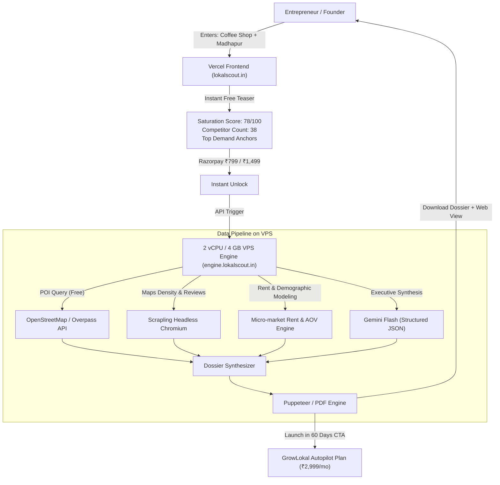

# LokalScout (`lokalscout.in`) — Production Implementation Plan
*Hyperlocal Business Feasibility & Location Intelligence Platform*  
*Powered by GrowLokal*

---

## 1. Executive Summary & Value Proposition

Every year across India, hundreds of thousands of entrepreneurs, doctors, dentists, salon owners, and franchisees invest between **₹15,00,000 and ₹60,00,000** to set up a brick-and-mortar commercial space. Over 60% fail within 18 months, overwhelmingly due to **poor location selection, extreme competitor saturation, or mismatched target demographics**.

Currently, solo founders rely on "gut feeling" or walking around an area for an hour. Enterprise GIS tools (Esri, Carto) or real estate consultancies (JLL, CBRE) cost lakhs and cater strictly to Fortune 500 chains (Starbucks, McDonald's).

**LokalScout (`lokalscout.in`)** bridges this gap:
- An accessible, instant, data-backed feasibility intelligence engine for Indian cities.
- Input: **Business Vertical** (e.g. *Specialty Coffee Shop, Dental Clinic, Unisex Salon, Cloud Kitchen*) + **Locality / Pin Code** (e.g. *Madhapur, Hyderabad*).
- Output: An instant **10-Section Location Feasibility Dossier** featuring competitor saturation, demand anchors, local search volume, commercial rent benchmarks, break-even math, and AI-identified strategic gaps.
- **The GrowLokal Flywheel**: Serves as a high-margin standalone revenue generator (₹799–₹1,499 per report) while acting as the ultimate top-of-funnel customer acquisition magnet for GrowLokal's core subscription (₹2,999/mo).



---

## 2. Infrastructure Sizing & Split Architecture

To maximize cost efficiency and operational stability, the workload is strictly partitioned:

| Component | Hosting Environment | Specifications & Allocation | Monthly Cost |
| :--- | :--- | :--- | :--- |
| **Frontend & Public UI** | **Vercel** (Hobby Tier) | Next.js 15, Global Edge CDN, SSL, React Server Components | **₹0** |
| **Scouting API & Worker** | **Extra Dedicated VPS** | 2 vCPU, 4 GB RAM, 100 GB SSD (Ubuntu 24.04 LTS) | **Already Owned** |
| **Domain** | Cloudflare DNS | `lokalscout.in` (Apex on Vercel, `engine.lokalscout.in` on VPS) | ~₹450 / year |
| **Data Sources** | Overpass API + Scrapling | OpenStreetMap POIs + Headless Chromium | **₹0** |
| **LLM Synthesis** | Google Gemini API | `gemini-2.5-flash` structured JSON outputs | ~₹0.15 / report |
| **Payments** | Razorpay PG | Standard domestic UPI / Netbanking gateway | 2% per transaction |

### VPS Resource Allocation (4 GB RAM Budget)
- **FastAPI / Python Application**: 400 MB
- **Headless Chromium / Scrapling Worker**: 850 MB (concurrency capped at 2 via `asyncio.Semaphore`)
- **Local SQLite / DuckDB Cache**: 150 MB
- **PDF Renderer (Headless Chrome print)**: 600 MB (on-demand transient)
- **Caddy Webserver (Auto Let's Encrypt SSL)**: 60 MB
- **Ubuntu OS + System Services**: 300 MB
- **Buffer / Idle Headroom**: **~1.6 GB free**

---

## 3. Data Pipeline & Zero-Cost Sourcing Engine

The intelligence report combines four distinct data streams without requiring costly enterprise GIS subscriptions:

### Stream A: Footfall Anchors & POIs (OpenStreetMap / Overpass API)
- **Cost**: ₹0.
- **Query Type**: Bounding box / 2.5 km radius around target coordinate.
- **Entities Extracted**:
  - `amenity=college`, `amenity=university`, `amenity=school` (youth footfall).
  - `office=*`, `building=commercial` (IT parks, corporate tech clusters).
  - `leisure=fitness_centre`, `amenity=marketplace`, `shop=mall` (consumer spending anchors).
  - `highway=bus_stop`, `railway=subway_entrance` (metro and transit accessibility).

### Stream B: Competitor Density & Review Sentiment (Scrapling Worker)
- **Cost**: ₹0 (runs on the VPS residential/datacenter connection).
- **Entities Extracted**:
  - Exact direct competitors in the same vertical within 1 km, 2 km, and 5 km.
  - Google Maps star rating distribution (e.g. % rated >4.5 vs. <4.0).
  - Total review count volume (establishes review velocity and competitive moat).
  - Top 5 recurrent customer complaints extracted from 1-star to 3-star reviews (e.g., "no parking", "long wait time", "expensive filter coffee").

### Stream C: Commercial Rent & Financial Benchmarks (Heuristic Engine)
- Pre-compiled dataset of micro-market commercial rental bands across Tier 1 & Tier 2 Indian cities (Hyderabad, Bangalore, Mumbai, Delhi-NCR, Pune, Chennai).
- Standard operational cost model:
  - Food & Beverage: 28–32% COGS, 12–15% Rent, 18–20% Staff.
  - Healthcare / Clinics: 15–20% Consumables, 10–12% Rent, 25–30% Professional Staff.
  - Salons & Wellness: 10–14% Consumables, 14–18% Rent, 30–35% Stylists.

### Stream D: Strategic Opportunity Synthesis (Gemini 2.5 Flash)
- Passes aggregated numbers into a strictly typed Pydantic schema:
  - Overall Feasibility Score (0–100).
  - Viability Classification (`Blue Ocean`, `High Demand High Competition`, `Over-Saturated`, `Underserved Niche`).
  - 3 Specific "Unfair Advantage" Recommendations.
  - Break-even footfall calculation.

---

## 4. The 10-Section Deliverable (What the Customer Receives)

The generated report (available as an interactive web dashboard and a downloadable PDF) contains 10 structured sections:

1. **Executive Feasibility Scorecard**: Overall score (e.g. 82/100), risk rating, and quick decision summary.
2. **Competitor Saturation Map & List**: Complete inventory of competitors within 2 km, their ratings, review counts, and price tiers.
3. **Price Tier & Offering Distribution**: Breakdown of existing players (Budget vs. Mid-Range vs. Premium).
4. **Footfall & Demand Anchors**: Proximity to tech parks, residential societies, colleges, and transit stations.
5. **Peak Commute & Activity Windows**: When the locality experiences peak footfall (Morning rush vs. Evening social).
6. **Local Search Intent & Demand Signals**: Monthly Google search trends for high-intent keywords in that area.
7. **Commercial Real Estate Benchmarks**: Estimated rent per square foot for main road vs. by-lanes.
8. **Financial Break-Even Calculator**: Step-by-step projection of required daily customers and ticket size to cover rent and OPEX.
9. **Competitor Weakness & Gap Analysis**: Aggregated pain points from competitor reviews, revealing what customers are missing.
10. **The "Launch with GrowLokal" Action Plan**: Exclusive pre-launch roadmap with ₹1,000 credit toward GrowLokal Autopilot.

---

## 5. Technical Implementation Blueprint

### Phase 1: VPS Backend Engine (`engine.lokalscout.in`)

#### Directory Structure on VPS:
```
/opt/lokalscout-engine/
├── docker-compose.yml
├── Dockerfile
├── requirements.txt
├── Caddyfile
├── app/
│   ├── main.py
│   ├── config.py
│   ├── routers/
│   │   ├── search.py
│   │   ├── feasibility.py
│   │   └── webhooks.py
│   ├── services/
│   │   ├── geocoding.py       # Nominatim / Photon reverse geocode
│   │   ├── overpass.py        # OpenStreetMap POI extraction
│   │   ├── scraper.py         # Scrapling competitor crawler
│   │   ├── financial_model.py # Rent & break-even math
│   │   ├── ai_synthesis.py    # Gemini Flash structured JSON
│   │   └── pdf_generator.py   # Puppeteer / HTML-to-PDF
│   └── templates/
│       └── report_template.html
```

#### `requirements.txt`:
```text
fastapi>=0.115.0
uvicorn[standard]>=0.32.0
pydantic>=2.10.0
scrapling[all]>=0.3.0
httpx>=0.27.0
google-genai>=1.0.0
jinja2>=3.1.4
razorpay>=1.4.1
python-dotenv>=1.0.1
```

#### Docker Compose on VPS (`/opt/lokalscout-engine/docker-compose.yml`):
```yaml
version: "3.8"

services:
  caddy:
    image: caddy:2-alpine
    container_name: lokalscout_caddy
    restart: always
    ports:
      - "80:80"
      - "443:443"
    volumes:
      - ./Caddyfile:/etc/caddy/Caddyfile
      - caddy_data:/data
      - caddy_config:/config

  api:
    build: .
    container_name: lokalscout_api
    restart: always
    environment:
      - PORT=8000
      - GEMINI_API_KEY=${GEMINI_API_KEY}
      - RAZORPAY_KEY_ID=${RAZORPAY_KEY_ID}
      - RAZORPAY_KEY_SECRET=${RAZORPAY_KEY_SECRET}
      - RAZORPAY_WEBHOOK_SECRET=${RAZORPAY_WEBHOOK_SECRET}
      - API_AUTH_SECRET=${API_AUTH_SECRET}
    deploy:
      resources:
        limits:
          memory: 2500M
    volumes:
      - reports_data:/data/reports

volumes:
  caddy_data:
  caddy_config:
  reports_data:
```

---

### Phase 2: Vercel Frontend (`lokalscout.in`)

#### Tech Stack:
- Next.js 15 (App Router)
- React 19
- Tailwind CSS with modern dark/light luxury slate aesthetics
- Lucide React & Recharts
- Framer Motion micro-interactions
- Razorpay Checkout.js wrapper

#### Key Routes:
- `/`: Hero, dual input bar ("Category" + "Locality / Pin Code"), live sample preview carousels, testimonials.
- `/report/[reportId]`: Interactive report dashboard. Shows Section 1–2 for free, and renders an elegant blurred glassmorphism overlay over Sections 3–10 with an instant "Unlock Full Dossier for ₹799" CTA.
- `/sample`: A 100% unlocked live showcase report for *Specialty Coffee Shop in Madhapur, Hyderabad*, allowing visitors to inspect the full depth before purchasing.
- `/compare`: Compare two competing areas side-by-side (₹1,499 tier).

---

## 6. Monetization & Pricing Strategy

```
┌──────────────────────┬──────────────────────┬──────────────────────┐
│     FREE TEASER      │     FULL DOSSIER     │   AREA COMPARISON    │
│         ₹0           │        ₹799          │       ₹1,499         │
├──────────────────────┼──────────────────────┼──────────────────────┤
│ • Overall Score      │ • Complete 10-Part   │ • Side-by-Side 2 or  │
│   (e.g. 78/100)      │   Dossier            │   3 Locality Scan    │
│ • Direct Competitor  │ • Full Competitor    │ • Comparison Matrix  │
│   Count within 2 km  │   Ratings & Reviews  │ • Rental vs Demand   │
│ • Top 3 Footfall     │ • Break-Even Model   │   Trade-off Engine   │
│   Anchors            │ • Strategic Gaps     │ • 2 Complete PDF     │
│ • Requires Mobile OTP│ • Downloadable PDF   │   Dossiers           │
└──────────────────────┴──────────────────────┴──────────────────────┘
```

### Pro Scout Subscription (B2B):
- **₹3,999 / month**
- Target: Commercial Real Estate Brokers, Architects/Interior Designers, Franchise Consultants.
- Includes 10 full dossiers per month with white-label agency branding.

---

## 7. The GrowLokal Cross-Sell Conversion Engine

The core strategy is to turn every ₹799 report buyer into a ₹2,999/month recurring GrowLokal subscriber:

1. **In-Report Pre-Launch Offer**:
   - The final section of every report features:  
     *"Opening in Madhapur soon? Don't launch to an empty shop. Claim ₹1,000 off your first month of GrowLokal Autopilot — we set up your Google Maps 3-Pack, launch landing page, and WhatsApp lead system before your opening day."*
2. **Automated WhatsApp Follow-Up Sequence (Day 3, Day 14, Day 45)**:
   - Day 3: *"Hi Rahul, here is a quick tip on commercial lease negotiation for Madhapur based on your report."*
   - Day 14: *"Finalizing your location? Here is the pre-launch checklist to ensure Google Maps verifies your address in 24 hours."*
   - Day 45: *"Getting close to opening day? Let's turn on your GrowLokal launch campaign."*

---

## 8. Step-by-Step Execution Schedule

| Timeline | Phase | Key Milestone | Deliverable |
| :--- | :--- | :--- | :--- |
| **Day 1** | VPS Foundation | Setup Docker, Caddy SSL, and FastAPI scaffold on the 2 vCPU VPS | Working `GET /health` on `engine.lokalscout.in` |
| **Day 2** | Data Sourcing | Implement Overpass POI client + Scrapling competitor search | Structured JSON containing POIs & competitors |
| **Day 3** | Synthesis & PDF | Integrate Gemini 2.5 Flash for scoring + Puppeteer HTML-to-PDF | Complete 10-page generated PDF cached to disk |
| **Day 4** | Vercel Frontend | Scaffold Next.js 15 UI, search bar, and report preview with blur-lock | Live frontend on `lokalscout.in` (Vercel) |
| **Day 5** | Payments & Flow | Wire Razorpay checkout and webhook unlock pipeline | End-to-end paid report generation live |
| **Day 6** | GrowLokal Bridge | Add "LokalScout" entry point to GrowLokal dashboard & landing page | Seamless cross-navigation between both products |
